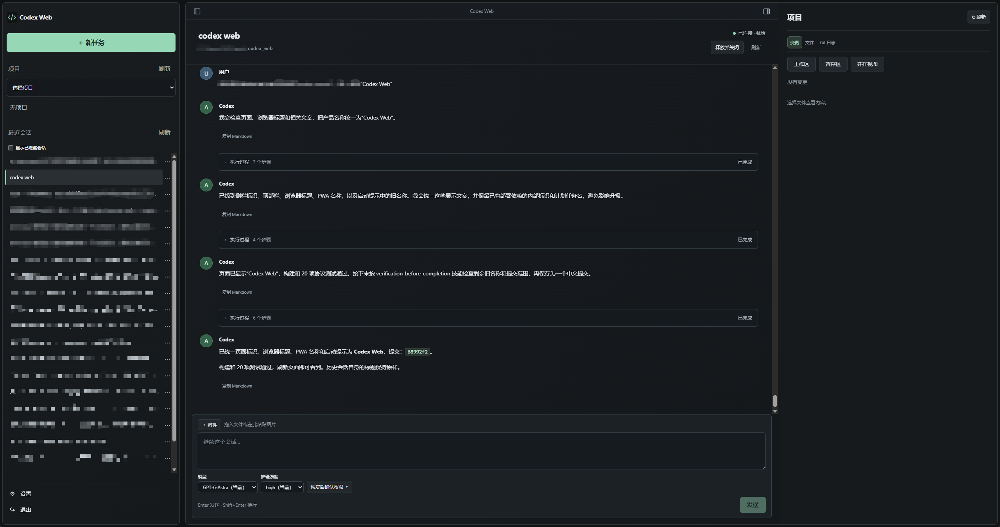
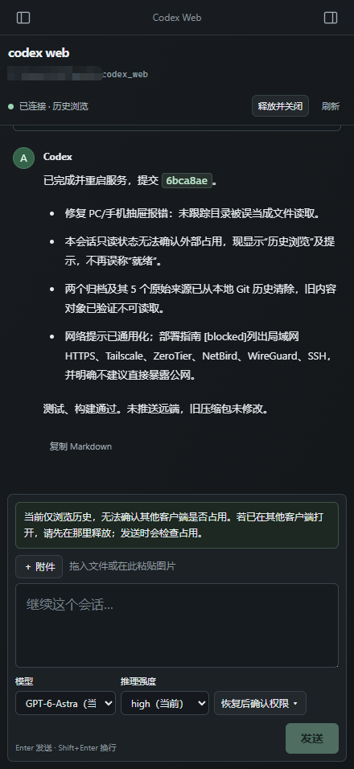

# Codex Web

[中文](README.md)

A lightweight web client for Codex running on your development machine, accessible locally or remotely. Use a desktop or mobile browser to manage projects, continue native Codex Threads, inspect live execution and Git changes, and respond to approvals. The official standalone Codex CLI handles agent execution and conversation history; the Web service uses the host user's Codex login.

## Features

- Select an existing project, use no-project mode, create a Git project or clone a repository; continue conversations, steer running tasks, interrupt, and release for handoff.
- Live incremental synchronization, paginated history, on-demand command output, safe Markdown, and original-text copying.
- Resizable, remembered three-pane layout; text, Markdown, and image previews, unified/split diffs, read-only Git history, and JUnit reports.
- Native model, reasoning, and approval choices; rename, favorite, hide from Web, and clear Web metadata.
- Private file/image attachments, Web Push, and a PWA that caches only the static shell.

## Screenshots

**Desktop**



**Mobile**



## Platforms and prerequisites

| Host platform | Scope |
| --- | --- |
| Windows | Existing verification covers source execution, the Windows x64 portable package, and scheduled-task deployment; see the latest record for this round's regression status |
| Linux | An x64 glibc portable package is available; source execution, live tasks, and sandbox boundaries have been verified as a non-root user on WSL2 Ubuntu 22.04; no claim covers all distributions |
| macOS | Not adapted or verified in this round |

Running from source requires Node **>=24.20.0**, npm, the official standalone Codex CLI, and Git for project/Git features. `.node-version` declares the baseline; it does not switch Node automatically. Install and sign in using the [official Codex instructions](https://learn.chatgpt.com/docs/codex/cli). Linux/WSL must use the Linux CLI and its own environment's login. Do not rely on binaries inside the VS Code extension's private directory.

## Run from source

Create the default work root `~/work` (`%USERPROFILE%\work` on Windows), or set `WORK_ROOT` to an existing directory; the service does not create it automatically. Then run in the project directory:

```sh
npm ci
npm run build
npm run auth:setup
npm start
```

Skip setup if a password already exists. Set a 12–256-character password in your local interactive terminal. The default URL is `http://localhost:3000`; the service listens only on `127.0.0.1`. `npm run dev` starts only the frontend development server; use build + start for the complete service. See the [deployment guide](docs/guides/deployment.md) for remote access, configuration, and upgrades.

The default work root is the current user's `~/work` (`%USERPROFILE%\work` on Windows); only immediate project directories are discovered. `.local/web/config.json` configures `origin`, `port`, `workRoot`, and `codexBin`. The corresponding `WEB_ORIGIN`, `PORT`, `WORK_ROOT`, and `CODEX_BIN` environment variables take precedence; `WEB_DATA_DIR` changes the data directory. Windows defaults to the official standalone CLI installation location; Linux defaults to `codex` on PATH.

Deployment scripts are organized into [`scripts/windows/` and `scripts/linux/`](scripts/README.md). After building and setting a password, Linux users can run `bash scripts/linux/start-server.sh` in the foreground, or install a user systemd service with `bash scripts/linux/install-startup.sh --start`. See the deployment guide for stopping, logs, and Tailscale configuration.

On Windows, double-click `scripts/windows/start-server.cmd` to start a source deployment in the background. Logs are written to `.local/web/server.log`; closing the launcher window does not stop the service. Double-click `stop-server.cmd` to stop it. CMD launchers prefer an existing PowerShell 7 installation and otherwise use built-in Windows PowerShell 5.1; no extra PowerShell installation is required. Matching CMD launchers also configure startup and network access.

The Files, Changes, and Git History tabs preview PNG, JPEG, WebP, GIF, AVIF, and SVG images, scaled to fit the panel. Changes show before/after images from the actual worktree, index, or commit, including additions, deletions, and renames. SVG is rasterized and animations show their first frame. Limits are 10 MiB and 40 megapixels per image, with a preview long edge of at most 2048 pixels. Files also lists and reads files excluded by `.gitignore`; project boundaries, authentication, and sensitive-file protection still apply. The Changes list follows Git tracking rules and clears selections that disappear after a successful refresh.

Git History uses icons and short names for local branches, remote-tracking branches, and tags. You can select branches such as `origin/main`; All branches also includes remote-only history. All three tabs share the Refresh button beside Project: local content reloads immediately while fetch runs in the background, then the graph updates. Browsing and chat remain available; failures retain local content and show a message. Fetch is skipped when no remote exists. Concurrent requests for a project are merged, with results reused for 10 seconds; limits are 30 seconds per remote and 60 seconds overall. Only remote-tracking branches are updated or pruned; local branches, tags, the index, and working files remain unchanged. Automatic refreshes and tab switches do not trigger fetch. See the [workspace design](docs/design/workspace-panels.md).

## Local and cross-device access

Local use does not require a virtual network. For cross-device access, connect the client and development machine to the same LAN or an authorized virtual network, and keep the machine and service online. **Direct public-internet exposure is not recommended. Prefer a virtual network with authentication, encryption, and access controls; Tailscale is one example.**

The service listens only on loopback, so cross-device access also requires a restricted proxy or tunnel. Options include a LAN HTTPS proxy, Tailscale, ZeroTier, NetBird, WireGuard, or SSH forwarding. See the [deployment guide](docs/guides/deployment.md#网络访问方式) for comparisons, official documentation, and a Tailscale HTTPS example.

## Portable packages

Download the appropriate package from [GitHub Releases](https://github.com/sxcooler/codex_web/releases) and fully extract it into a writable directory:

| Package | Start |
| --- | --- |
| `codex-web-VERSION-win-x64.zip` | Double-click `Start.cmd` |
| `codex-web-VERSION-linux-x64.tar.gz` | Run `tar -xzf PACKAGE.tar.gz`, enter the extracted directory, then run `bash Start.sh` |
| `codex-web-VERSION-source.zip` | Platform-independent clean source; follow the source setup above |

Portable packages include Node and platform-specific production dependencies; Node/npm installation is unnecessary. Git and Codex CLI are separate prerequisites. First-run setup asks for the work root, CLI, port, and password. If Codex is missing, install manually using the official page or explicitly consent to running the official installer for your platform. Account sign-in remains separate. Keep the terminal open and press Ctrl+C to stop; use `--no-browser` on headless Linux hosts.

The Linux package targets x64 glibc systems, with WSL2 Ubuntu 22.04 as the verification environment. ARM64, Alpine/musl, and macOS packages are not provided. Do not copy `node_modules` between platforms. Build natively with `npm ci` followed by `npm run package:portable`; artifacts are written to `releases/`. See the [portable package guide](docs/guides/portable.md) for configuration, upgrades, build prerequisites, and verification.

## Usage and boundaries

Conversation menus support native archiving; switch the sidebar to Archived to restore a thread. Hide from Web only changes Web preferences. User message blocks align right, with available native turn start/completion times beside role names. Missing timestamps and individual steering-message times are not inferred. Long filenames, commit entries, source and diffs scroll horizontally within their panels; Markdown prose still wraps.

Opening or manually refreshing a conversation checks native write ownership before sending. Web holds the conversation after a successful resume; another app holding the writer triggers an early notice and Retry button while history remains readable. The check sends no model message; automatic history synchronization does not reacquire ownership. Switching conversations or opening a new task requests release of the previous conversation, deferred until completion if it is running or awaiting approval. Manual “Release and close” leaves the page only after release is confirmed. Use one writer per Thread at a time. VS Code may retain ownership after a response completes; close the corresponding project window before returning to Web. The app does not forcibly take ownership. An empty Thread may not persist before its first message; releasing or restarting can lose the empty Thread while retaining project files.

A timeout or lost connection can leave a submission's outcome unknown. Check native history before explicitly retrying; refreshing never resends a task. Drafts survive within the current page lifecycle, but a full reload does not guarantee retention. Project context does not replace native Codex permissions. Web file and Git APIs remain restricted to validated project boundaries; there is no arbitrary shell/RPC REST endpoint. See the [session guide](docs/guides/sessions.md).

Web Push requires HTTPS, browser support, and explicit user permission. Physical-phone background delivery and real VS Code handoff for phase-two features still have verification gaps. The PWA does not cache APIs, conversations, or credentials; tasks cannot be submitted offline.

## Documentation and verification

Detailed documentation is currently in Chinese:

[Documentation index](docs/README.md) · [Architecture](docs/design/architecture.md) · [Latest Linux verification](docs/verification/2026-09-13-linux.md) · [Phase-two verification](docs/verification/2026-09-11-phase2.md) · [Historical MVP verification](docs/verification/2026-09-09-mvp.md)

```sh
npm test
npm run build
npm run protocol:generate
npm run probe -- doctor
```

After upgrading the CLI, regenerate the protocol, review differences, and verify compatibility. Generated files live in the ignored `.local/` directory. `probe -- read` only reads an existing test Thread. start/verify/reverse/interrupt/approval consume the existing account's usage and leave native history. verify refuses to resend after an attempt; do not delete attempt records to bypass that protection. Historical records retain their dates and versions and do not prove deployment on your machine. Updating source does not update an already-running service.

## Public releases

Public examples use generalized usernames, paths, and conversation IDs. Source archives **exclude `.git` and local runtime data**. Before pushing a repository, also review the Git history being published; deleting a current file does not remove its history. Do not upload `.local/`, native Codex data, credentials, attachments, databases, logs, unredacted screenshots, or test artifacts. Reviewed, redacted showcase images in `docs/assets/screenshots/` may be published with the documentation. See the [publishing guide](docs/guides/publishing.md) for the reviewed scope and its limits.
