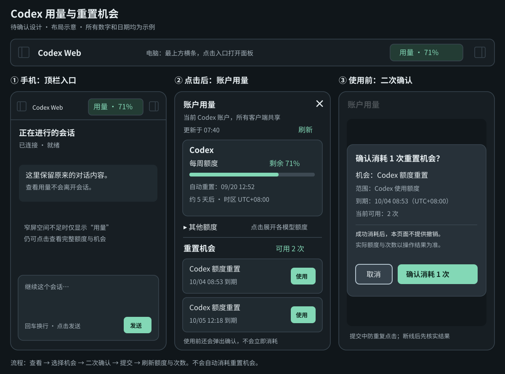
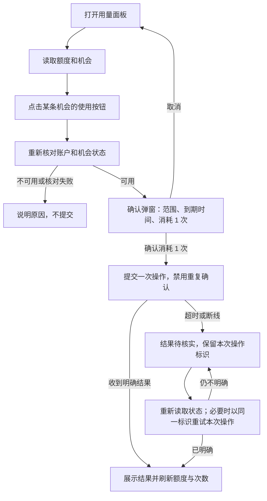

# Codex 用量与重置机会

状态：**已实施并验证**。更新日期：2026-09-15。

方案已获确认；图中的百分比、次数和日期都是示例，不代表账户当前状态。实现与验证不消耗真实账户的重置机会。

## 1. 要解决的问题

随时查看当前原生 Codex 账户还剩多少额度、什么时候自动恢复，以及还有几次可以主动使用的重置机会。用户主动使用机会时，必须先看清影响，再二次确认。

这是**账户用量**，同一账户在其他客户端的消耗也会影响它，不是当前会话的 token 统计。

| 名称 | 含义 | 是否主动消耗机会 |
| --- | --- | --- |
| 自动重置时间 | 某个额度周期预计恢复的时间，例如每周额度 | 否 |
| 重置机会 | 原生账户提供的一次主动重置资格，有自己的到期时间 | 用户确认使用后，按原生服务结果处理 |

## 2. 界面示意

图为布局示意，最终间距、字号沿用现有页面；不以示意图中的留白或尺寸改变会话页面布局。

### 2.1 顶栏入口

- 位置：页面最上方显示 **Codex Web** 的横条，品牌文字右侧、右侧栏按钮左侧。电脑与手机均能访问，登录后的会话、首页和设置页使用同一个入口。
- 正常显示 `用量 · 71%`，含义是 **Codex 主额度组中，当前最紧张周期的剩余比例**。例如 5 小时剩余 80%、每周剩余 71%，入口显示 71%。面板分别展示两个周期。
- 以 `codex` 额度组为准，不把不同模型的独立额度相加或平均，也不让入口随当前会话模型变化。
- 数据未返回、原生版本不支持，或没有可识别的 Codex 主额度时，只显示 `用量`；失败或过期数据显示状态标记，不把旧值当实时值。
- 手机空间不足时缩成 `用量`，保留左右侧栏按钮，点击区域至少 44×44 CSS 像素。

### 2.2 用量面板

点击入口打开对话框：电脑居中显示；手机在当前页面上展开接近全屏的面板，内容独立滚动。关闭后回到原会话、保留草稿和滚动位置。

从上到下展示：

1. **账户用量**标题、关闭按钮，以及“当前 Codex 账户，所有客户端共享”的说明。
2. 最近成功更新时间、刷新按钮；请求过程中显示加载状态。
3. **Codex** 主额度组：每个实际返回的周期分别显示剩余百分比、进度条、自动重置日期和倒计时。
4. **其他额度**：按原生返回的名称分组，例如 Spark；默认折叠，展开后使用相同展示规则。
5. **重置机会**：可用总次数；每条机会的标题、重置范围、到期时间和“使用”按钮。

展示规则：

- 剩余比例由 `100 - usedPercent` 计算并限制在 0–100%；周期名称从 `windowDurationMins` 得到，不硬编码每个账户都同时有“5 小时”和“每周”。
- 时间按浏览器本地时区显示，并标注时区；保留绝对日期，不只显示倒计时。到达预计重置时间后刷新，不能直接把百分比改成 100%。
- `null` 或不合法字段显示“暂不可用”，不能显示成 0；原生明确返回 `expiresAt: null` 才显示“无到期限制”。
- 可用次数以 `availableCount` 为准，详情条数可能更少。详情缺失时写明“部分/全部机会详情暂不可用”，不猜测到期时间，不提供无法确认范围的使用按钮。
- 已过期、正在使用、已使用或类型无法识别的机会不提供“使用”操作。原生返回的标题和描述按纯文本渲染。
- 本期不加入购买额度、套餐升级或单会话 token 图表。

## 3. 消耗机会与二次确认

### 3.1 正常流程

1. 用户在某条可用机会旁点击 **使用**；先重新读取账户与机会状态，尚不消耗机会。
2. 状态仍可用时打开确认弹窗，列出该机会的名称、重置范围、到期时间、当前可用次数。
3. 明确提示：**“确认后将尝试消耗 1 次重置机会。成功消耗后，本页面不提供撤销操作。”** 不承诺会重置接口未明确说明的其他模型额度。
4. 两个按钮：**取消**、**确认消耗 1 次**。初始焦点放在取消按钮；Escape 或点遮罩等同取消。首次“使用”点击不能穿透到确认按钮。
5. 只有第二次明确点击确认才发送消耗请求。提交中禁止重复确认，同一账户的其他使用按钮也暂时禁用。
6. 展示原生操作结果，并重新读取用量和次数。不能仅在前端把次数减 1、把额度加满。

### 3.2 结果与异常

| 原生结果/情况 | 页面行为 |
| --- | --- |
| `reset` | 提示“重置成功”；刷新后的额度与次数为准 |
| `nothingToReset` | 提示“当前无需重置”；重读数据，不自行判断或修改次数 |
| `noCredit` | 提示“该机会已不可用”；刷新机会列表 |
| `alreadyRedeemed` | 提示“该机会已使用”；刷新，不再消耗另一条机会 |
| 提交前发现机会已过期/账户已切换 | 取消该确认流程，要求在最新状态下重新选择 |
| 请求超时、断线或结果无法识别 | 标记“结果待核实”；不当作失败后新建一次操作，不自动换另一条机会 |
| 已收到成功结果，但随后刷新失败 | 保留“重置成功”，同时提示“用量更新失败”；不能把整个操作显示为失败 |

### 3.3 避免重复消耗

- 每次经确认的逻辑操作生成一个 UUID `idempotencyKey`，携带选定的 `creditId`；重试必须使用同一对值。该键让原生服务识别“这是同一次操作”。
- 请求发出前，在当前浏览器保存待核实操作的键、机会 ID 和账户标识，不保存账户凭据。刷新或关闭面板不能丢掉操作身份；退出登录清除界面数据，重新登录后先核对账户再恢复待核实状态。
- 后端校验登录、CSRF、账户一致性、参数格式及机会状态；以同一账户的正在执行操作防止并发点击。客户端重试已发出的同一操作时，先处理已有操作状态，避免因机会已使用而误判成可发起新操作。
- 最终去重依赖原生接口的幂等语义，而不是只靠按钮置灰；Web 服务重启后也不能换键重试。
- 若原生接口不能可靠确认账户身份或不支持幂等重试，则禁用消耗功能并说明原因，仍可查看用量。

## 4. 数据与接入方式

依据本机 Codex CLI 0.153.4 生成协议核对接口。此前已成功只读获取账户额度和重置机会；**未调用消耗接口**。正式实现时需再次核对运行版本的字段和支持情况。

| 层级 | 拟议接口/职责 |
| --- | --- |
| 浏览器 → Web | `GET /api/account/usage`：当前账户用量、机会与成功读取时间 |
| 浏览器 → Web | `POST /api/account/usage/reset`：经二次确认，提交 `creditId`、`idempotencyKey` 和预期账户标识 |
| Web → 原生运行时 | `account/rateLimits/read`：只读；多额度优先取 `rateLimitsByLimitId`，旧返回回退到 `rateLimits` |
| Web → 原生运行时 | `account/rateLimitResetCredit/consume`：传入 `creditId`、`idempotencyKey`，处理四种原生结果 |

- 复用现有登录认证、CSRF、Runtime/app-server 通信，不新增依赖或数据库。
- 用量读取做 30 秒、按账户隔离的内存缓存，并合并同时到达的读取请求。手动刷新、打开确认弹窗前以及消费后均绕过缓存。
- 登录后读取一次，页面可见时每 60 秒更新；切回前台且数据超过 30 秒时刷新。页面隐藏时停止轮询，避免每个会话重复创建计时器。
- 读取失败保留旧数据并标明读取时间及失败状态；账号切换或退出登录立即清除旧账户展示和缓存。重置前必须拿到新鲜数据。
- 额度读取与消耗都不创建会话、不启动模型任务、不更改会话模型或权限。
- 当前协议的重置总数类型为 `bigint`，Web 层需显式转换为可序列化的十进制字符串，不能因 JSON 序列化导致整个面板失败。
- 不展示或记录完整账户凭据；原生错误经过现有错误处理后返回，日志仅保留必要的操作状态。

## 5. 可访问性与验收

对话框有可读标题、焦点限制和关闭后焦点恢复；加载、成功和错误使用可读状态提示。额度进度条带名称和百分比文本，不只通过颜色表达状态。手机纵向、横向以及桌面都能查看全部内容与操作按钮。

实施后的验收范围：

- 浏览器：入口可达、面板关闭保留草稿；不同周期展示正确；取消确认不发起消耗；确认只发一次；重复点击和刷新不会新建消耗操作。
- 后端：未登录和无效 CSRF 拒绝；账户不匹配、过期/未知机会、无效参数拒绝；同一操作重试保持原标识。
- 状态：四种原生结果、超时待核实、成功后刷新失败、只有总数没有详情、多额度、缺失字段和到期边界。
- 真实账户默认只做读取验证；验证真实消耗必须由用户在面板二次确认后执行，不能把用户机会当测试数据使用。

## 6. 已确认范围

1. **入口和布局**：顶栏按钮；电脑对话框、手机接近全屏面板；主额度优先，其他额度折叠。
2. **重置交互**：每条机会单独“使用”，再次确认才提交，结果不明时先核实。
3. **范围**：账户额度、自动重置时间、主动重置机会及到期时间；不增加购买/升级入口。

## 7. 实施细节

- 重新生成并核对 CLI 0.153.4 协议；初始化没有重置能力清单，因此仅对已审核的 `codex_remote_web/0.153.4` 原生版本启用消耗。其他版本继续只读，明确说明原因；升级支持前需重新核对幂等契约。
- 主账户标识来自同一用量响应的 `accountId`，Web 使用其 SHA-256 摘要，不返回邮箱或凭据。`account/read` 的邮箱/套餐摘要只用于缓存失效检查，不能替代账户标识。原生账户/额度通知、Web 退出登录及操作结束都会使缓存失效；读取中失效的数据不交给浏览器。
- 在已有 `metadata.sqlite` 增加 `account_reset_operations` 表，保存账户摘要、机会 ID、幂等键与结果，不新增数据库。发送前先落库；同一账户最多一个结果待核实的操作。服务重启后仍可重试原操作，已知结果直接返回，未知结果不因机会已被消耗而阻止同键核实。
- GET 的 `pendingReset` 提供当前已核实账户的待核实操作，使另一个浏览器或丢失本地存储后也能继续核实。不同账户不能互相恢复或覆盖操作。读取、关闭面板和轮询均不自动消耗。
- 原生消耗协议没有原子的预期账户参数；提交前在同一个 app-server 实例再次读取并校验账户和已审核版本，然后立即发送明确的 `creditId`。不省略机会 ID，也不让原生服务自动挑选另一条机会。
- 总次数的有效 bigint / 安全整数 / 十进制字符串均转换为十进制字符串；已丢失精度的数字视为未知。非法到期值与明确的 `null` 保持区别。
- 已确定的提交前拒绝取消本地确认流程；网络、超时和无法识别结果继续保留原操作。成功结果与随后读取失败分开显示。

## 8. 验证结果（2026-09-15）

- Windows Node 24.20.0：全量 208 项，203 通过、5 项环境条件跳过；WSL Ubuntu 22.04 普通用户：208 项，202 通过、6 项平台或环境条件跳过；均无失败。最后定向用量回归 12 项通过，TypeScript 和生产构建通过。
- Chrome 桌面、390px 手机及 844×390 横屏：用量显示、多额度、超大次数、到期边界、二次确认、取消与 Escape、焦点恢复、重复点击、未知结果同键重试、服务端待核实操作恢复、账户切换和关闭后草稿保留通过。桌面/手机的原会话发送、同步、历史分页、执行过程、Git 和双侧栏回归通过。
- 修复并回归了毫秒更新时间误显示为不可用、预检响应在面板关闭后误开确认、成功后刷新失败吞掉成功状态等问题。原生标题与描述作为纯文本显示。
- 当前本机 CLI 0.153.4 通过真实只读检查：账户标识可识别、返回 3 个额度分组、次数可序列化、30 秒缓存命中。未调用真实消费接口，未启动模型任务。
- 后端账户边界、同实例版本核对、持久化幂等与 API 认证/CSRF 通过独立复核。运行中的旧服务需重启后加载新接口；不在验收中中断现有会话。
