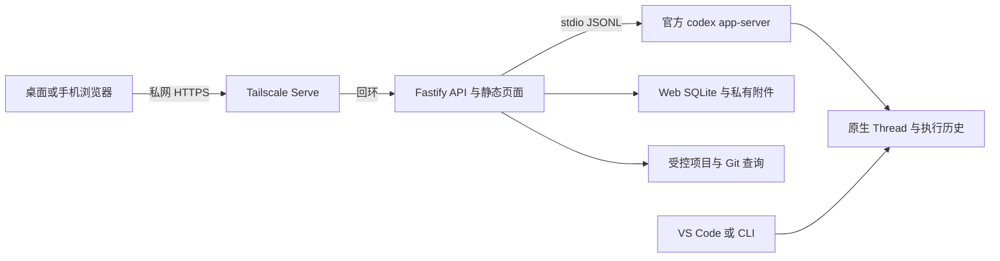

# 当前架构

Codex Remote Web 是单用户远程客户端：React 页面经同源 Fastify API 与 SSE 连接宿主上的官方独立 `codex app-server`。原生 Thread ID 就是 Web Session ID；不另建聊天后端。平台验证范围见 [首页](../../README.md)，部署见 [指南](../guides/deployment.md)。

## 模块与数据责任

| 模块 | 责任 |
| --- | --- |
| `src/server/` | 配置、认证、API、SSE、元数据、上传、Push 与响应压缩 |
| `src/codex/` | CLI 定位、stdio RPC、Thread/Turn 生命周期、审批与同步 |
| `src/projects.ts` | 一级项目发现/创建/Clone、安全文件与只读 Git 操作 |
| `src/web/` | 页面、会话交互、布局、Markdown、文件/Git 面板 |
| `scripts/` | 本地配置、协议诊断、Windows 启动与便携打包 |

Node 内置 SQLite/crypto 保存 Web 元数据和登录 token 散列；聊天与工具历史以 Codex 原生存储为准。附件保存为私有文件及 Web 数据库引用，已发送资源持续保留。浏览器只持久化布局与轻量面板选择，不把聊天正文写入持久缓存。构建使用 TypeScript、React、Vite；依赖版本以 package-lock.json 为准，无 ORM、队列或外部数据库。

## 运行与协议

Backend 常驻，单个 app-server 按需启动并管理多个 Thread；每个 Thread 仅一个活动 Turn。stdio 参数数组启动、`shell:false`，stdout 专用于 JSONL，stderr 仅诊断。先 initialize 再 initialized，RPC ID 关联响应，服务端请求单次答复；消息有大小上限、超时和退出处理。仅排除继承的宿主会话身份变量，不改 CODEX_HOME、凭据或强制权限配置。

只读打开不抢占 writer，发送恢复原 Thread；旧会话保留原 cwd，不猜测跨系统盘符映射。提交结果未知不重试，幂等记录只保证本后端生命周期。中止等待原生终态；取消订阅与 writer 释放是不同事实，所有任务空闲后才能关闭自己的 runtime。共享进程仍忙时可能延迟释放，不能强杀其他客户端。[会话工作区](session-workspace.md) 记录状态、权限、附件和释放边界，[同步](session-sync.md) 记录水位、回放、分页与按需输出。

## 访问边界

服务固定监听回环，远程通过私网 HTTPS。单管理员密码、HttpOnly/Strict Cookie、精确 Host/Origin、CSRF、限速和 schema 校验覆盖业务 API/SSE。认证撤销关闭相应 SSE；断浏览器连接不停止任务。PWA 只缓存静态资源；API 与敏感数据 no-store。

项目来自 WORK_ROOT 一级项目目录；路径按宿主语义比较，Windows 折叠大小写、Linux 保留大小写。文件/Git 路径以真实目录边界校验，不因原生 Agent 权限较宽而放宽 Web 文件接口。Git 参数数组执行、禁用外部 diff/textconv，日志仅查询，不提供 checkout/reset/fetch。项目创建部分失败保留已成功目录和 Thread，避免重复执行。安全 Markdown 不执行 HTML、不自动请求远程图片；输出视为不可信内容。

原始需求、方案取舍、历史 Windows 环境与暂缓项见 [初始设计归档](../archive/initial-design.md)。当前会话/面板专项设计优先于历史接口草案；Linux 与便携安装变更见 [本轮方案](linux-support-and-docs.md)，当前验收状态见 [验证记录](../verification/2026-09-13-linux.md)。
